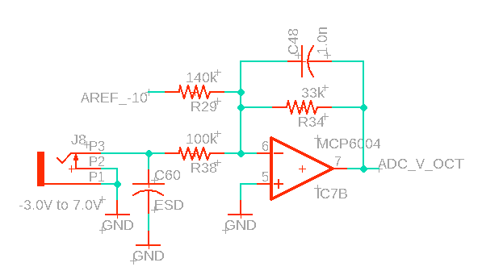

# CalcisHumilis Roadmap and Design (Oct 15, 2025)

This document turns the high-level plan into concrete, code-referenced steps. It’s intended to guide small, incremental PR-sized changes.

## 1) Board portability and feature sets

Goal: Prepare for multiple boards without churn: RP2350 (Olimex Pico2 XL/XXL) and WeAct STM32H562.

What we already have
- Board abstraction with per-board definitions: `src/platform/boards/pico2.h` (PinDefs and PinSource via PinMux) and selector `src/platform/boards/Current.h` used by `UI`, `View`, and `Screen`.
- Platform abstraction for time: `src/platform/platform.h` with millis/micros shims.

Planned structure (minimize ifdefs)
- Board profiles (compile-time):
  - [x] Add `src/platform/boards/pico2.h` with role-based constants (PinDefs) and a PinSource (PinMux of GpioPins + MCP expander).
  - [x] Add `src/platform/boards/olimex_pico2xl.h` with GPIO-only PinSource and per-board pin roles.
  
  - [x] Selector header: `src/platform/boards/Current.h` aliases the active board; make selection configurable via a build flag (e.g., `-DBOARD_STM32H562`), falling back to Pico 2 by default.
  - Optionally, keep a thin compatibility layer for legacy `pins.h` if needed (deprecated).

- Pin handlers / adapters:
  - [x] Keep `ButtonManager` and `QuadManagerIO` unchanged. They operate against a device exposing `setPinMode(pin)`, `readPins<K>(idxs)`, and `writePin(pin, bool)`. We now pass the unified PinSource (PinMux) as the device.
  - ~~For expander removal: swap `using PinExpander = hw::io::Mcp23017Pins` with `hw::io::GpioPins<N>` in `UI` and `View`.~~
    - Replaced with a unified `PinSource` that multiplexes GPIO and expander transparently; `UI` and `View` consume `boards::current::PinSource` and `PinDefs`.

- Extended vs cut-down feature sets (prefer templates over ifdefs):
  - Provide light wrapper types instead of `#if`: e.g., `using ScreenSaversT = ScreenSaversEnabled;` vs `ScreenSaversNoop;` chosen via a single `using` in a small selector header.
  - For profiler: macro already no-ops when `PROFILE` off; keep as-is.
  - For optional LEDs/savers: introduce tiny types with the same interface so call sites remain compile-time polymorphic without scattering `#if`s.

Acceptance / steps
 - [x] Create `src/platform/boards/pico2.h` with PinDefs and PinSource; add `boards/Current.h` selector and use it in modules.
 - [x] Create `src/platform/boards/olimex_pico2xl.h` with GPIO-only PinSource and per-board pin roles.
 
 - [x] Update `UI.h`/`View.h`/`Screen.h` to use `boards::current::{PinSource, PinDefs}`; raw pins for third-party libs via `.pin()`.
 - [x] Smoke test on hardware (Pico 2): LEDs blink, buttons/encoders tick, U8g2 renders.
 - [x] Smoke test on hardware (Olimex Pico2‑XL): LEDs, buttons, encoders, I2S audio (PCM5100), SSD1309 screen.
 

## ~~2) Streamline UI-changed parameter processing (deferred)~~

Decision: Keep the simple "snap full config per audio buffer" approach for now. After adding a 256-float padding array, average snapping time went from ~2 µs to ~8 µs on the current profile — acceptable for simplicity.

Note: If this becomes a bottleneck, revisit an event-driven param change queue and per-param interpolation.

## ~~3) Log/exp envelopes~~

Status: Implemented.

- Added compact curve parameter with inexpensive shaping in `mod::ADEnvelopes`:
  - `EnvCurve` with `setCurve01(float)` producing attack/decay polynomials
  - Branch-light per-sample shaping cached as `curved_` and read via `value(i)`
- Config/plumbing:
  - `Calcis::Cfg::envs` includes the curve via `EnvCfg{ attack, decay, depth, EnvCurve }`
  - UI mapping available via `EnvCurveMapper::make(...)` (0..1 → curve)
- Verified via native tests and profile builds; processing time unchanged.

## 4) Modulation Matrix (routing) and Map Mode UI

Goal: Flexible, static modulation routing between modulators (envelopes now, CV/LFO later) and destination parameters.

Scope
- ModMatrix core (static, no dynamic allocations):
  - Route: { sourceId, paramId, depth, bipolar flag, enabled }
  - Fixed-capacity array (e.g., 16–24 routes); per-parameter indices for fast lookup
  - Source values from `ADEnvelopes::value(i)` (unipolar 0..1), later CV/LFO
- Parameter transforms (per-destination):
  - Amp/Morph: linear add with clamp [0..1]
  - Pitch: semitone-domain add then convert to Hz
  - Cutoff: log2-domain add (octaves) then convert
- Integration points:
  - Apply routes per-sample for time-critical params (amp, pitch, cutoff)
  - Use existing BlockInterpolator for smoothing modulated outputs when needed

Visual Map Mode (UI)
- Activate Map Mode via dedicated button. Flow:
  1) Enter Map Mode
  2) Select parameter page normally
  3) Press a modulator button (e.g., Env A) to pick source
  4) Turn a parameter’s knob to set route depth (creates route if missing)
- Rings show modulation depth when in Map Mode; press knob to clear a route.

Acceptance / steps
- [ ] Add `ModMatrix` core (header-only) with enums for sources/params and per-destination apply functions
- [ ] Integrate into audio loop near where envelopes are consumed; keep route count small
- [ ] UI: add Map Mode state, source selection via page buttons, ring rendering for depths
- [ ] Minimal persistence of routes in config

References
- `src/mod/ADEnvelopes.h` (source values), `src/CalcisHumilis_impl.hh` (integration site)
- `src/ui/UI.h` (pages/buttons), `src/ui/Controller.h` (knob handling), `src/ui/View.h` (rings)

## 4a) Unified parameter handling and per-sample modulation (policy)

Goal: Make every parameter modulatable per-sample (FM-friendly), while keeping the filter path simple, safe, and performant. Unify UI and audio-loop handling via a single source of truth for parameter ranges and mappings.

What we’ll standardize
- Single ParamSpec registry (one header) as the ground truth for parameters:
  - 0..1 normalized domain, min/max, toDomain() / fromDomain() for UI and DSP.
  - Pitch-like params (osc freq, filter cutoff) map in octaves (exponential). Q uses a perceptual power curve. Morph stays linear 0..1.
  - This registry is used by UI mappers, Mod Matrix, and DSP config, so semantics are identical everywhere.

Per-sample modulation strategy (hybrid)
- Exact-on-boundary, delta-in-between:
  - At block/micro-block boundaries, compute exact targets (e.g., g = tan(pi*f/SR), k = 2/Q).
  - Within the block, update per-sample using derivatives for speed and FM-style behavior:
    - g += (pi/SR) * (1 + g*g) * df; k = 2/Q (or dk = −2/Q^2 * dQ if using deltas).
  - On large stepped jumps (e.g., quantized CV), re-seed g from exact tan() on that frame; no extra “dezipper” unless artifacts are audible.

Clipping/limiting and safety
- No soft clipping inside the signal path except the final output stage; use hard clamps at most inside mapping code.
- TPT SVF core remains; mild integrator leak stays. Optional state soft-saturation is available if needed for worst-case modulation, but default is to keep the core linear and rely on the final limiter.

Parameter definition layout
- Move all parameter specs to a single header (e.g., `src/app/params/Spec.h`), and reference them from UI pages (grouping happens elsewhere). This keeps mapping rules centralized and reusable.

Dezippering and bandwidth policy
- No dezippering unless we hear artifacts. One tanf per pitch-like parameter at micro-block boundaries is acceptable.
- No bandwidth limiting for cutoff by default; reserve BLEP/BLAMP or other bandlimits for oscillators or sharp edges (e.g., square).

Acceptance / steps
- [ ] Add ParamSpec registry header with 0..1 ↔ domain functions per parameter (Hz, Q, morph, amp, pitch, etc.).
- [ ] Use ParamSpec in Mod Matrix apply functions and in UI mappers so both share identical transforms.
- [ ] Implement hybrid update: exact target recompute at block/micro-block boundaries; derivative deltas per sample; re-seed exact tan() on large steps.
- [ ] Keep final output limiter only; avoid intermediate soft clips; evaluate state soft-sat only if instability or harsh artifacts are observed under extreme modulation.

## 5) Consolidate parameter pages

Goal: Pages users understand quickly: source, filter, modulation, FX (optional).

References
- Page wiring currently in `UI::initSpecs()` (see `src/ui/UI.h`).

Plan
- Define four page groups in `initSpecs()`:
  1. Source (Swarm now; later engines will select alternative page sets)
  2. Filter (already in place via `FilterMapper`)
  3. Modulation (envelopes, depth/rate/intensity, targets)
  4. FX (optional; delay/drive/reverb placeholders)
- Keep mappers built with current macros (`ZLKM_UI_*_MAPPER(...)`).

Acceptance / steps
- [ ] Update `initSpecs()` to group parameters per above.
- [ ] Add TODO markers for engine-based conditional pages.

## 6) Per-parameter widgets in UI

Goal: Draw meaningful widgets for the selected parameter(s).

References
- Current view draws four ring bitmaps and textual info (see `src/ui/View.h`).

Plan
- Add widget interfaces inside `View` (virtuals OK here):
  - Either simple free functions, or a tiny abstract base `IWidget` with `virtual void draw(U8G2&, const Rect&) const = 0;` and concrete implementations.
  - Helpers: `drawFilterWidget(U8G2&, const SafeFilterParams&, rect)`, `drawEnvWidget(U8G2&, const EnvState&, rect)`.
  - Start simple: for Filter, draw cutoff dot/line across a log-x axis, and a resonance marker; for Env, draw ADS shape from current rates.
- As a screensaver/default view, consider a small oscilloscope using downsampled audio (UI core) or feedback metrics; guard under `FEAT_SCOPE`.

Acceptance / steps
- [ ] Add widget helpers to `View.h` and call them when not idle.
- [ ] Optional scope screensaver under feature flag.

## 7) New sound engines

Goal: Add FM next, then experimental stereo-bounce.

References
- Current engine: Swarm oscillator (see `src/audio/MorphOsc.h`, used via `UI::initSpecs()` bindings).

Plan
- Abstract engine selection:
  - Introduce `enum class Engine { Swarm, FM, Bounce }` in config.
  - Provide per-engine config structs; the top-level `Calcis::Cfg` holds a tagged union or distinct sub-structs plus an active engine.
- FM engine:
  - Minimal 2–4 operator with fixed algorithm to start; reuse `SafeFilterParams` downstream unchanged.
  - Add mapper pages under “Source” when Engine=FM.
- Stereo-bounce (fun engine):
  - Procedural motion mapping to stereo panning and timbre; fits as a separate “Source” variant.

Acceptance / steps
- [ ] Add `Engine` tag to config.
- [ ] Introduce `audio/engines/FM.h` with a tiny render() integrating into the existing audio loop.
- [ ] Populate UI pages conditionally based on active engine.

## 8) Voltage control (Plaits-style)

Hardware
- Normalization probe: one probe GPIO fanned out through ~10 kΩ per-channel resistors into the CV input nodes, with a diode-based bias/clamp network (as seen in Plaits). This biasing creates a detectable signature on unpatched inputs without requiring switch jacks.
- Single Vref and MCP6004 for buffering/scaling (components on order).

Software
- ADC via DMA if available (RP2350/STM32H5) or polled fallback; double-buffered capture.
- Simple filtering: EMA or small FIR per CV channel; optional decimation.
- Normalization detection: drive a small square wave on the probe GPIO and detect its presence on each CV ADC channel; use correlation or a simpler phase/magnitude check tailored to the diode-bias network; add hysteresis for patched/unpatched.
- Processing in audio loop: push CV-derived param changes into the same ring buffer; respect rate limit.

Acceptance / steps
- [ ] Add `src/hw/cv/CvReader.h` (DMA-capable with polled fallback) + `CvChannelState` with smoothing.
- [ ] Add `src/hw/cv/NormProbe.h` (probe GPIO driver + per-channel correlation and hysteresis; native test with synthetic sequences).
- [ ] Bind one CV channel to a param via existing InputMapper to validate end-to-end.

### VOCT (1 V/Oct) input

Hardware

- VOCT jack is conditioned by a diode-based bias/clamp and resistor network, then buffered by MCP6004 before the ADC (see schematic above).
- Aim for a clean, low-impedance source into the ADC and predictable biasing when unpatched (for normalization detection).

Software
- Calibration: compute linear calibration for ADC → volts: `V = a * adc + b` using two known notes (e.g., C2 and C4) during a simple calibration mode.
- Pitch mapping:
  - Semitone offset: `semitones = 12 * V` (relative to 0V reference), or use `note = note0 + 12 * V`.
  - Frequency: `f = f_ref * 2^V`; integrate with `Calcis::cycles(f)` to set oscillator base frequency (`cyclesPerSample`).
  - Keep smoothing very light or S/H-based to avoid glide; snap when near semitone boundaries if desired.
- Integration: feed VOCT changes into the ParamChangeQueue; interpolate minimally on the audio side for click-free updates.

Acceptance / steps
- [ ] Add `src/app/cv/Voct.h` with calibration state `{a,b}` and helpers `adcToVolts()`, `voltsToHz()`, `voltsToSemitones()`.
- [ ] Add a native test for Voct mapping: two-point calibration → expected semitone mapping and octave linearity.
- [ ] Wire one CvReader channel to update `cfg.cyclesPerSample` via `Calcis::cycles(f)`.

## 9) Other Hardware platforms to support

Goal: Expand beyond RP2350 variants; start with WeAct STM32H562.

Acceptance / steps
- [ ] Create `src/platform/boards/stm32h562.h` with equivalent PinDefs and PinSource (likely GPIO-only initially).
- [ ] Smoke test on hardware (STM32H562) once the board profile exists.

## 10) Ideas / experiments

- Filters: add LP/HP variants and separate Drive into FX; explore self-oscillation paths.
- Input mapping gestures: long-turn acceleration, push-and-turn modes, tab-modifier keys.
- Display: evaluate yellow-scale OLED; abstract `ScreenSSD` creation so pin and controller variants are swappable.

- Param change queue (future):
  - Only propagate changed params via a small SPSC queue; fall back to a full snapshot when saturated.
  - UI throttling to audio cadence and per-param interpolation over short windows.
  
- Modulation architecture (ECS-like):
  - Consider an Entity-Component-System style layout for flexible modulator composition.
  - Keep each modulator constrained to 4 parameters to remain lightweight and UI-friendly.

Acceptance / steps
- [ ] Add a second filter preset in UI pages toggled by a simple switch; keep DSP unchanged initially.
- [ ] Add an acceleration curve in `Controller::update()` for large encoder deltas.
- [ ] Add a `Screen` factory hook to select alternate OLED model under a single typedef or small selector.

---

## References (by file)
- `src/platform/boards/Current.h`: active board selector used across UI and Screen.
- `src/platform/boards/pico2.h`, `src/platform/boards/olimex_pico2xl.h`: board pin roles and PinSource.
- `src/platform/platform.h`: millis/micros shims.
- `src/ui/UI.h`: pin usage, initSpecs() page definitions, component wiring.
- `src/ui/View.h`: tab LEDs, ring UI, screensavers, and LED animations.
- `src/ui/Controller.h`: parameter changes and `seedFromCfg()` inverse mapping.
- `src/hw/io/ButtonManager.h`, `src/hw/io/QuadManagerIO.h`: reusable IO primitives.
- `src/audio/DJFilter.h`: filter and `SafeFilterParams` bridge.
- `src/CalcisHumilis_impl.hh`: audio loop integration points for parameter consumption.

## Notes
- Keep native tests (`pio test -e native`) as the fast validation loop. New pieces (ParamChangeQueue, widget helpers) should have focused tests where possible.
- Avoid dynamic allocation and virtuals in hot paths. Prefer compile-time selection and SPSC queues.
